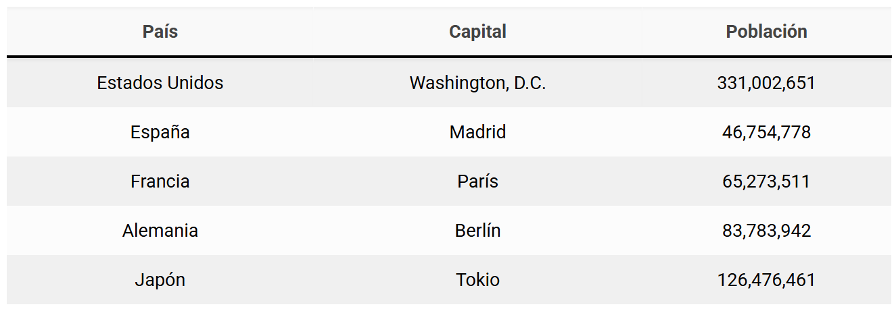

# Ejercicio 1: Tabla paises
Este ejercicio ha sido sacado de esta web [Ejercicios Markdown](https://www.eniun.com/ejercicios-markdown-practicas-resueltas-sin-resolver/)
## Resultado esperado

## Ejercicio
|País|Capital|Población|
|:--:|:-----:|:-------:|
|**Estados Unidos**| Washington, D.C. | *331,002,651* |
|**España**|Madrid|*46,754,778*|
|**Francia**|París|~~65,273,511~~ *66,356,709*|
|**Alemania**|Berlín|*83,783,942*|
|**Japón**|Tokyo|*126,476,461*|

# Ejercicio 2: Código
## Java
``` java
final int EDAD = 18;
System.out.printf("Hola, tengo %d años", EDAD);

```
## HTML
``` html
<html>
    <head></head>
    <body></body>
</html>

```
## CSS
```css
body{
    background-color:red;
}

```

# Ejercicio 3: Citas importantes

> Para conseguir el símbolo de ~~tachar~~ : alt gr + 4

