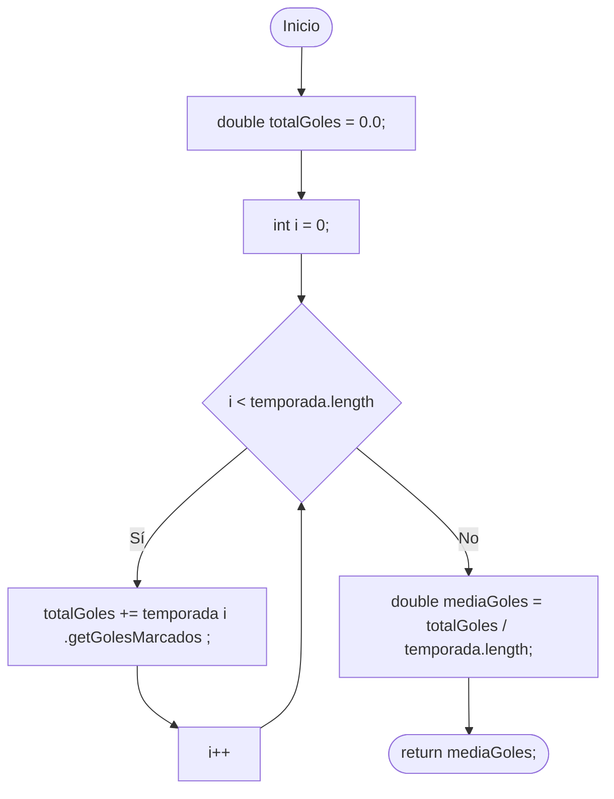

# Mermaid Prueba

Este diagrama explica un método para sacar la media de goles marcados de un equipo en una temporada

```mermaid
flowchart TD
    A([Inicio]) -->B[double totalGoles = 0.0;]
    B --> C[int i = 0;]
    C --> D{i < temporada.length}
    D --> |Sí| E[totalGoles += temporada i .getGolesMarcados ;]
    E --> F[i++] -->D
    D --> |No| G[double mediaGoles = totalGoles / temporada.length;]
    G --> H([return mediaGoles;])
```